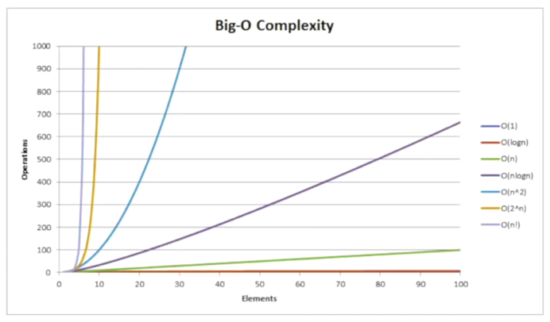
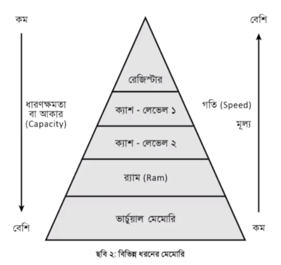

# Complexity (Time & Space)

<header align="center">
  <h3>What is complexity ?</h3>
  <p>The art of programming is the art of organization complexity.</p>
</header>

## Types of complexity

- 1. Time Complexity
- 2. Space Complexity

<h1 align="center">Time Complexity</h1>

<!-- image of time complexity -->
<p align="center">
  
  <br /> <span>Fig: Time Complexity</span>
</p>

### Operation of Time Complexity

- 1. Assignment Operation // a=b, x=10
- 2. Comparison Operation // a>b
- 3. Mathematical Operation // 2+6
- 4. Function Called Operation // x=f(x)
- 5. Functional Operation

Here, A program complexity count `BigO notation`. That means, `O(1) / Order of 1` called a program complexity.

```c
  // example of time complexity
  #include<stdio.h>

  int main() {
    int n1, n2, result;

    n1 = 10; // Assignment Operation = O(1)
    n2 = 20; // Assignment Operation = O(1)

    result = n1 + n2; // Assignment + Mathematical Operation = O(1) + O(1)
    return 0;
  }

  // Here, This program total `Time complexity O(4)` but total `Time complexity O(1)`. Because a program operation can't depended her input numbers here input numbers is constant. So that total program `Time complexity O(1)`.
```

<h1 align="center">Space Complexity</h1>

<!-- image of time complexity -->
<p align="center">
  
  <br /> <span>Fig: Space Complexity</span>
</p>

```c
  // example of space complexity
  #include<stdio.h>

  int main() {
    int num;

    printf("Please enter a number: ");
    scanf("%d", &num);

    if(n%2 == 0) {
      printf("%d is even number.", num);
    } else {
      printf("%d is odd number.", num);
    }

    return 0;
  }

  /** Here,
      Time complexity = O(1),
      Space complexity = O(1)
   */
```

<p align="center">
  <strong> HAPPY PROGRAMMING 😀 & I LOVE PROGRAMMING 💖 </strong>
</p>
