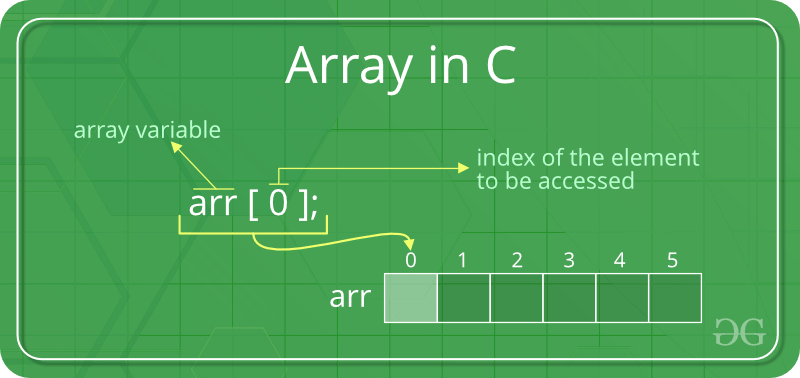

# Data Structure Of Array

<!-- article of array -->
<article align="center">
  <h2>What is Array ?</h2>
  <p>Array is a collection of variable in same data type.</p>
</article>

<!-- image of array -->
<p align="center">
  
</p>

### Array declaration in `C Programming Language`

```c
  // valid declaration
  int a[5];
  int a[] = {1, 2, 3, 4, 5};

  // invalid declaration
  int a[];
  int n, a[];
  int num[] = {"a", 1, 4, "c". 5};
```

### There are three types of Array in `C Programming Language`

- 1. 1D Array
- 2. 2D Array
- 3. Multi Dimension Array

### There are two types initialization of Array in `C Programming Language`

- 1. Run time.
- 2. Compile time

### There are five operations of Array in `C Programming Language`

- 1. Traversal
- 2. Insertion
- 3. Searching
- 4. Sorting
- 5. Deletion

<p align="center">
  <strong> HAPPY PROGRAMMING 😀 & I LOVE PROGRAMMING 💖 </strong>
</p>
